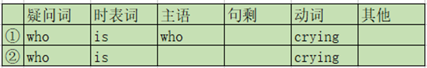

1、时态：16种

四种时态：

**一般现在时：**do/does

**一般过去时：**did

**一般将来时：**be going to do

**现在进行时：**be doing

2、中文流程：

==疑问词+时表词+主语+句剩+动词==

主语：动作发起者

宾语：动作承受者

疑问词：who       what       whose      which 	when      where      why        how

时表词：每一个时态的第一个词是时表词

动词：每一个时态的最后一个词是动词

句剩：每一个时态除了第一个词和最后一个词之外还有剩下的部分是句剩

**1、特殊疑问句与一般疑问句的差别：** **①表象上：特殊疑问句有疑问词，一般疑问句没有**

**②本质上：特殊疑问句有多重回答，一般疑问句只有两种回答：是或者否**

**2、否定疑问句**：在时表词后加not

**3、现在进行时表将来**

**不可以延续的动词，可以用现在进行时表将来！**

你要去北京吗
Are you going to Beijing
Are you going to go to Beijing

不可以延续的动词，用现在进行时去造句，意思不成立，比如die是死的意思，I am dying，并没有我正在死这句话以及这种状态的成立性，所以，表将来！！

这样的词并不多，前期先记下已下几个词:
Go去   come来   leave离开   arrive到达   start开始   begin开始

例子：

他要走了吗？Is he going to leave?   /   Is he leaving?

**who和whom**

**时态判断讲解与习题**

7大体系

时态+被动语态+情态动词+虚拟语气+陈述句+从句+非谓语动词

从句：主语从句，宾语从句，表语从句

8大充节

连词，冠词，代词，使动词，使役动词，系动词，独立主格，倒装句

**知识点①：一般现在时**

一般现在时在上节课讲过，表示最近一段时间都会发生的相同动作，表示习惯,句子里一定会有“平常”“一般”“老”

 **总结下来两点：**

**①表示以现在为中心的时间段**

**②表习惯，句子里一定会有“平常”“一般”“老”**

Know 知道、认识
Have 有
Like 喜欢    hate 恨
Want 想要   need 需要
Look 看起来  look like 看起来像

接下来大家试着翻译几个句子
Do you have a pen
Do you like me
Do you want to go to BJ

大家会发现，这些句子翻译时并没有“平常”“一般”“老”这样的字眼
你有笔吗
你喜欢我吗
你想去北京吗

那么为什么会出现这种情况呢

**大家会发现需要加“平常”“一般”“老”这样字眼的词：eat come watch call。它们延续的时间比较短或者不能延续，一般不可能超过一天。而第二类词它们延续的时间可以很长**
比如
我从出生就认识他了，到现在为止认识40年（认识这个动作持续了40年）
我从小就想成为一名医生（想这个动作持续了很久）
我三年前开始喜欢英语一直到现在（喜欢这个动作持续了3年）
这个房子看起来很大（那么从房子被建到被拆的几十年里会一直持续这种状态）

**好，准备工作已经做好，现在我们明白了三点：
①一般现在时表示以现在为中心的一个时间段
②有一类词延续的时间短或不可以延续
③有一类词延续的时间长**
我们需要解决的问题：

直接上图

从上图，我们可以看出:
延续时间短的词，以eat 吃为例，从过去的某个时间开始，因为延续时间短，所以很快会结束，可是因为一般现在时表示从过去到现在的时间段，又要继续延续，所以只需要重新开始吃这个动作，结束后再延续，结束后再延续。。。
**因为在这个时间段内，重复相同的动作，所以，一般现在时表平常的习惯。**

而延续时间比较长的词know 知道，从过去的某个时间开始，不会间断，会一直延续完整个时间段，所以，**不表示习惯，所以，不用加“平常”“一般”“老”这样的字眼，而同时，它并没有任何特殊意义，就是最普通的一般现在时，表示这个时间段的事情而已！**
而这样延续时间长的词，时态极其好判断，不强调以前，不强调以后，就是现在。
再回到刚才的问题：你不认识他吗
大家现在应该能很清晰有根据的判断出时态来。
认识，延续时间长，没有强调你以前不认识他吗，也没有强调你以后不会认识他吗，而是就问现在的事情，所以是一般现在时！

**现在大家已经知道如何去判断一般现在时：
①如果延续时间短或不可以延续，表习惯，中文有“平常”“一般”“老”
②如果延续时间长，不强调以前或以后，就是一般现在时**

而能清晰判断出一般现在时，还不是最终目的，最终目的是，一般现在时这个最容易混淆的时态没问题后，四种时态就都会变得清晰，最终会有如下效果：

问题：aren't you going to love me
这句话对吗

通过这句话的判断，大家会发现，你们以前学习英语时，因为都是死记硬背，所以基本靠感觉去判断，可是如果你现在的感觉能靠得住的话，你就不用再继续学习了！

**今天教大家句子的正确判断方式：
①结构成立
②中文意思正确
③常用与地道**

记住：
你造出的句子只要满足前两点：①绝对正确②没有人会听不懂
你前期不需要也没资格去管常用与地道：
①外国人听不懂的只有结构不对没有任何语法可言的句子
②这种所谓的不常用不地道只占极少数，而你认知的地道很大一部分属于俚语俗语
③最基本的句子不会说，最基本的结构不知道，一味追求地道，最终成为最没意义的死记硬背

接下来，我们根据①和②来判断以下句子

大家会发现以上句子，无论从英语结构还是中文句子看都是成立的！！
可是这些简单而常用的句子，除了第一句外，你却很少见，也很难用的出来，所以应该对自己的英语水平能更加了解！

**知识点②：疑问词与主语相同的句子**

**一般现在时与一般过去时特殊性**

**①因为时表词与动词是同一个词**

**②使用与疑问词与主语相同的句子里**

第一节课我们就有讲到一般现在时与一般过去时有特殊性，可是前两节课并没有碰到，为什么？
因为他们的特殊性只会出现在疑问词与主语相同的句子里面！
那么什么是疑问词与主语相同的句子呢？
首先从中文上来判断：
谁告诉你的
谁杀了他
谁来乐
谁说的
谁干的
什么改变了他了人生
什么发生了
谁在哭
句中动词已用红色字体标出，大家会发现，动词前面只有一个疑问词，而疑问词又是动作的发起者，也就是主语，所以这样的句子类型就是疑问词与主语相同的句子！

接下来我们从英语的结构上来讲：
① 一般过去时
例句：谁给你打的电话

**第一步：按公式正常去造
第二步：当疑问词与主语相同时，省略主语
第三步：主语省略后，时表词与动词会挨在一起，变成一个词called（任何一个动词+did=动词的过去式）**
再给大家来个例子：什么发生了

②一般现在时
例句：谁认识他

第一步：按公式正常去造
第二步：当疑问词与主语相同时，省略主语
第三步：主语省略后，时表词与动词会挨在一起，变成一个词knows（任何一个动词+does=动词的三单形式：大部分在动词后加s，只有极少数个别，比如have的三单形式为has）

在这里需要记住一点：
当主语是who或what这样不知道几个人或几个物体时，都按单数算！！！
所以动词都要用三单形式！！
比如：
谁知道他的电话：who knows his number
谁喜欢我：who likes me
谁想去北京：who wants to go to BJ
谁需要钱：who needs money
谁平常来的更早些：who comes earlier
谁平常在家吃饭：who eats at home

**总结：因为一般现在时与一般过去时有特殊性，所以当省略主语，时表词与动词挨在一起时会变成一个词，分三步！
而现在进行时，与一般将来时因为没有特殊性，所以只需要前两步!**
比如
③现在进行时：
例句：谁在哭

第一步：按公式正常去造
第二步：当疑问词与主语相同时，省略主语
因为没有特殊性，时表词be 与 动词 doing 挨在一起时，无变化！
④一般将来时
例句：谁要来

第一步：按公式正常去造
第二步：当疑问词与主语相同时，省略主语
因为没有特殊性，时表词be 与 句剩going to 挨在一起时，无变化！

同时，因为come是不可延续性动词，所以还可以用现在进行时来表将来

 come back 回来

fly back 飞回来

fight back 反击

call back 打回去

run back 跑回来

pull back 拉回来

take back 夺回来

talk back 顶嘴

look back 回头看

give back 给、还回去

get back 弄回来

lean back 往后靠

turn back 转过身去

jump back 调回来

ask back 反问

