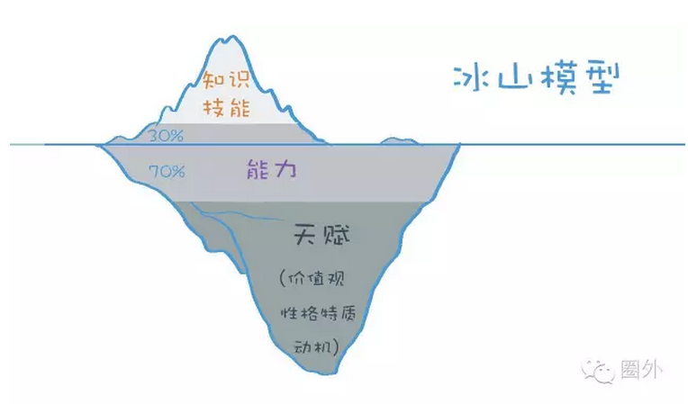

## 1.如何选择，才不辜负自己的努力

选择的误区：

- 纠结的不是选择，而是不确定性(做完选择之后不去纠结不确定性)
- 想要获得，却不愿割舍(敢于放弃，想要选择背后需要舍弃的是什么)
- 轻易把选择权让给别人(因为这会成为你将来放弃的借口)

如何选择一份工作：

- 一定要掌握全面的“一手信息”
- 在选择的时候，考虑“四大要素”：看行业、看公司、看部门、看老板和同事

## 2.你的市场价值，到底是怎么算出来的？

账面价值(薪酬)=实际价值(内在因素)+外部溢价(外在因素)

实际价值：冰山模型，全面地描述了一个人的个体素质要素

冰山模型包含三大要素：

- 知识和技能：比如财务知识；会编程，可培养
- 能力，或叫通用能力：比如学习和思考能力、人际交往能力，不太好衡量
- 天赋，包括价值观、性格特质、动机，常常自己也没能发现

越往冰山下面的部分，越难培养，越难发现，但是也因为门槛越高，越能成为竞争优势。

**如何选择价值定位**

- 知识型：单纯的知识储备增加，如果不能结合思维能力去解决一些具体问题，是很难为你增加财富的。
- 技能型：取决于技能的稀缺性
- 能力型：专业服务类以及管理类
- 天赋型：艺术、设计等

**想要收入更高，你需要**：

1.在学习新知识的时候，内化成能力。

2.有技能的，需要着力培养稀缺技能，当然，只能维持一段时间，所以需要持续关注市场。

3.能力，才是长久需要提升的，因为变化太快，只有能力是岗位间通用的。

4.最重要的，是不断尝试和总结，发现自己的天赋。

**大多数人不断学很多碎片化知识、练一些不稀缺的技能，然后不断跳槽。学一些零碎的内容，却很少实践。**

**在变化的时代，需要有不变的核心竞争力，才能从容应对，能力就是那个不变的东西。**

**性格代表意愿，是很难改变的，而能力却是可以提升的**

## 3.大多数人，是怎样挥霍自己天赋的

**哪些认知误区，让我们的天赋白白浪费**

1、认为天赋是能力：但实际上，天赋只是潜力

所谓天赋，指的是某种天生的特性，让一个人可以在同样起点的情况下，比一般人更加快速地成长。

天赋只代表一种潜力，是否能够转化为能力，则是需要后天刻意练习的。

2、天赋不行，努力来补：但实际上，努力也是一种天赋

一个人要能够更快地成长，需要两个要素，一是能力方面的天赋，也可以称为潜力；二是意愿方面的天赋。

3、天赋离一般人很远：但实际上，每个人都有天赋

意愿天赋：性格、动机和价值观偏好。比如成就感动机的人享受挑战

能力天赋：比如人际敏感度，数据敏感度，乐感

**跟你自己相比，你在A方面是比B方面更有潜力的，那么你花同样的时间，在A方面是比B方面成长快很多的，如果选择一个能利用A方面天赋的领域，你会起到事半功倍的效果。**

花时间去最大化你的天赋，比花时间去弥补自己的劣势，要有效得多。

**挖掘天赋的方法**

天赋的四个表现：SIGN

- 特征一：自我效能(Self-efficacy)，对自己可以完成某项工作或任务的自信程度。

- 特征二：本能(Instinct)，当你还没开始做这件事的时候，你就迫不及待地想要开始了。

- 特征三：成长/专注(Growth)，当你做这件事的时候，你充满好奇，十分专注，时间过得很快。

- 特征四：满足(Needs)，做完这件事之后，就算感到疲劳和困倦，你依然会有满足感。

怎么发现和挖掘天赋？

1.问自己

第一类问题：自我效能相关

你认为，自己能够教别人什么？或者，别人常常向你请教什么？

你跟他人聊天的时候，倾向聊什么？以及，聊什么话题你会更有自信？

你在做什么事情的时候，不会感到焦虑和担心？

第二类问题：本能相关

你在做什么事情的时候，很少拖延？

长时间休假后，你最想念工作的哪个方面、哪个内容？

你宁愿放弃休息时间，也要做的事情，是什么？

第三类问题：成长/专注相关

有什么事情，让你沉浸其中忘记吃饭/睡觉？

你在做什么事情的时候，会暂时忘记刷社交网络？

你在做什么事情的时候，不容易感到疲倦和厌烦？

第四类问题：满足相关

过去的工作和生活中，有什么让你获得巨大的成就感和满足感？

2.问他人

你觉得，我身上有什么不同于别人的特质？

你最欣赏或者佩服我的方面是什么？

在你看来，我做什么事情的时候，看起来最兴奋？

你曾经看到我做过哪件事情，让你印象深刻？

在以下这些方面，你觉得我哪些更加擅长？

思维方式：条理清晰、逻辑严密、脑洞很大、专注专业；

沟通协调：化解冲突、争取资源、知人善任；

计划执行：执行力强、追求完美、目标导向，等等。

## 4.“超级人脉王”有什么妙招？

**拓展人际网络的误区**

- “皇冠综合征”：只顾埋头做事，想着总有一天会有伯乐欣赏自己。要主动争取，有意识地树立个人品牌，主动地展现自己的价值。
- “名片囤积狂”：人际的关键在于价值互换，也就是彼此都能给对方带来资源、解决问题。

**如何拓展人际网络**

一个人际网络有四种角色：节点、专家、明星、助理。

- 节点：把大家连接在一起的人。善于跟大家打成一片，善于发现别人的优点、欣赏每一个人。
- 专家：掌握信息、知识甚至资源的人。
- 明星：善于说服的人，未必有很强的专业知识，但是他们很有人格魅力。
- 助理：在圈子里面提供服务的人。热心肠、做事有条理、不计回报。

## 5.学习比选城市和选对象都重要，扯淡吗？

**在这个时代学习需要注意什么**

- 稀缺技能辅以可迁移能力：考虑目前的阶段需要什么能力
- 系统化学习
- 注重实战

